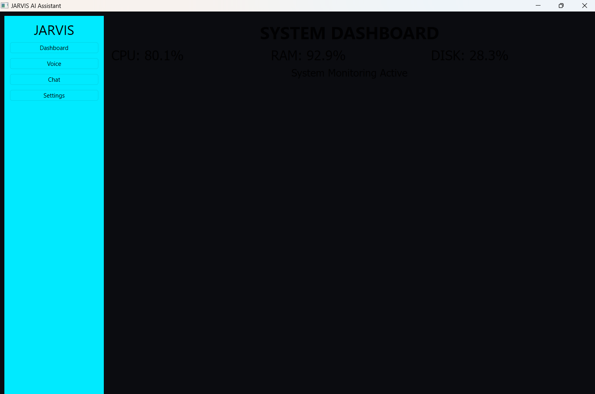
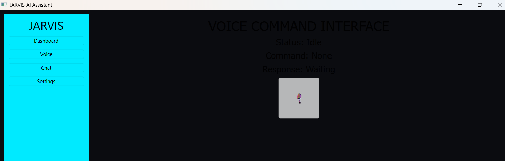
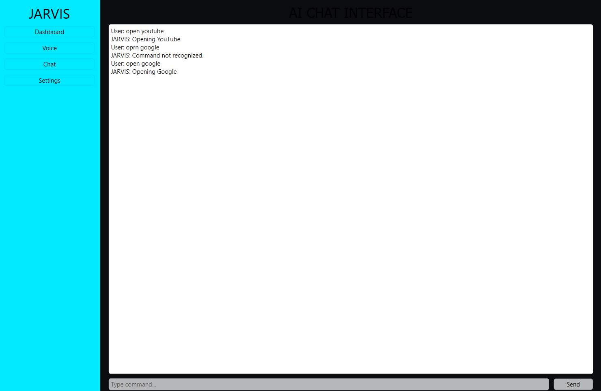
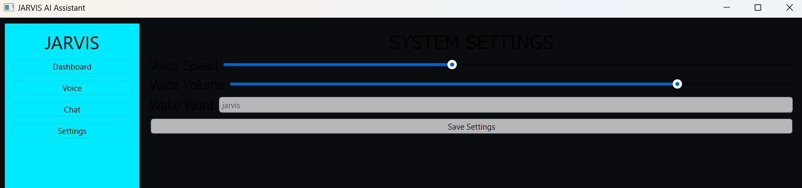

# Voice & Chat AI Assistant 🤖

A Python-based desktop AI assistant that supports **voice commands and chat interaction** to perform system tasks and automation.

This project demonstrates **modular architecture, object-oriented programming, and desktop UI development using Python**.

The assistant can execute commands, open applications, and interact through both **voice input and text chat**.

---

# Project Overview

Voice & Chat AI Assistant is designed to simulate a basic intelligent desktop assistant capable of handling commands through voice or chat.

The system processes user commands and performs actions such as launching applications or executing predefined automation tasks.

This project focuses on **clean architecture and modular system design**.

---

# Features

### Voice Commands

• Recognizes spoken commands
• Responds using text-to-speech

### Chat Assistant

• Text-based command interaction
• Simple command processing

### System Control

• Open applications
• Execute system commands

### Modular Structure

• Organized Python modules
• Easy to extend and modify

# Schreenshots :- 
### Dashboard

### Voice Interface

### Chat Panel

### Settings Interface

---

# Tech Stack

Programming Language
Python

GUI Framework
PyQt6

Voice Processing
SpeechRecognition
pyttsx3

System Monitoring
psutil

Data Storage
JSON datasets

---

# Project Structure

```id="9ppvye"
voice-chat-ai-assistant
│
├── core
│   ├── assistant_core.py
│   └── command_processor.py
│
├── voice
│   ├── voice_engine.py
│   └── speech_listener.py
│
├── system
│   ├── app_launcher.py
│   └── system_controller.py
│
├── ui
│   ├── main_window.py
│   ├── dashboard.py
│   ├── voice_interface.py
│   └── chat_panel.py
│
├── datasets
│   └── commands.json
│
├── assets
│   └── icons
│
└── main.py
```

---

# Running the Project

Start the assistant:

```
python main.py
```

---

# Example Commands

```
open chrome
open youtube
system status
shutdown computer
```

---

# Author

###Aditya Pagariya
###Engineering Student
